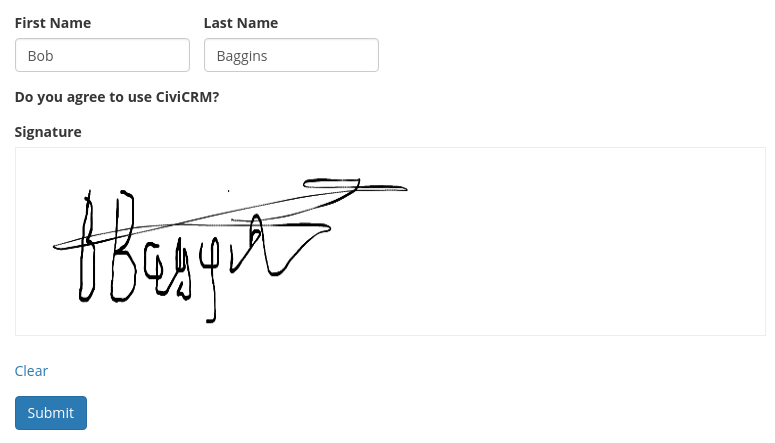

# webform_civicrm_esign

Module to work with the drupal esign module and add the signature as a file to a CiviCRM activity.

## Requirements
Does not work with CiviCRM 4.7.20 (a blank file is generated). Tested with CiviCRM 4.7.29, some earlier versions may work!.

## Setup
Download and install:
- webform_civicrm (https://www.drupal.org/project/webform_civicrm).
- Signature Pad library (https://github.com/szimek/signature_pad) (Release v2.3.0 - v3.0 does not get detected correctly by Drupal). _Reference: Drupal documentation [Installing an external library that is required by a contributed module
](https://www.drupal.org/docs/7/modules/libraries-api/installing-an-external-library-that-is-required-by-a-contributed-module)_
- esign (https://www.drupal.org/project/esign).
  - Requires webform_validation.
  - Enable modules esign and esign_webform.
  Note: If you want to disable the "signer name" and "signer title" fields on the esign field you need to use this patched version of the drupal esign module which adds checkboxes to the "esign" field type: https://github.com/mattwire/drupal_esign
- webform_civicrm_esign (https://github.com/mattwire/webform_civicrm_esign)

## Usage
For each webform that you want to save the signature to an activity you need:

#### In CiviCRM:

* An activity type with a "File" custom field.

#### On each webform:

* One or more fields of type `esign` (one per signature needed).
* A field with name: `esign_custom_field`; type: `hidden`; value: A comma-delimited list of custom field names (e.g., `custom_1` or `custom_1,custom_2`). If multiple custom fields are specified, they will correspond to the signature fields in the order you add them to the form.  See _[Setup Examples](#setup-examples)_ below.
* A field with name: `esign_entity`; type: `hidden`; value: A comma-delimited list of entities (e.g., `Activity` or `Activity,Participant`). If multiple entities are specified, they will correspond to the signature fields in the order you add them to the form.  See _[Setup Examples](#setup-examples)_ below.
* A field with name: `esign_entity_type_id`; type: `hidden`; value: A comma-delimited list of Activity Type IDs (for Activities and Cases) or Event IDs(for Participants). If multiple entitiy IDs are specified, they will correspond to the signature fields in the order you add them to the form.  See _[Setup Examples](#setup-examples)_ below.  You can also specify `All` instead of an entity ID; in that case, all records of this entity type will receive the signature.
* Make sure CiviCRM processing is enabled on the webform and that you have added at least one activity/and or event registration of the type(s) you specified in `esign_entity_type_id` field.

Optionally, file the activity on a case by enabling a Case within the CiviCRM processing and setting the Activity to "File on Case".

* Filenames will be created in the format "sig_20191119000000_firstnamelastname.png" if civicrm firstname/lastname fields are found.  If not name will be omitted.
* The hidden fields added above will not be shown in emails / submission views.

##### Setup Examples

|Use case|`esign_custom_field` example|`esign_entity` example|`esign_entity_id` example|notes|
|---|---|---|---|
|A single custom field on a single activity|custom_9|Activity|70||
|A single custom field on a single activity|custom_9|Participant|3||
|A single custom field on multiple activities (must be different types)|custom_9,custom_9|Activity,Activity|70,71||
|Two custom fields on a single activity|custom_9,custom_10|Activity,Activity|70,70|Note that the same activity_type_id is given twice|
|Different custom fields on different activities (different types)|custom_9,custom_10|Activity,Activity|70,71||
|An activity and a participant|custom_9,custom_10|Activity,Participant|70,3|activity_type_id for activity, event_id for participant|
|All new activities|custom_9|Activity|All||
|All participant records and a "meeting" activity|custom_10,custom_9|Participant,Activity|All,1||

## Known issues

* Due to a technical quirk, this module does not support attaching signatures to multiple activities of the same activity type/event in one form. Please submit an issue if you're interested in addressing this limitation.
